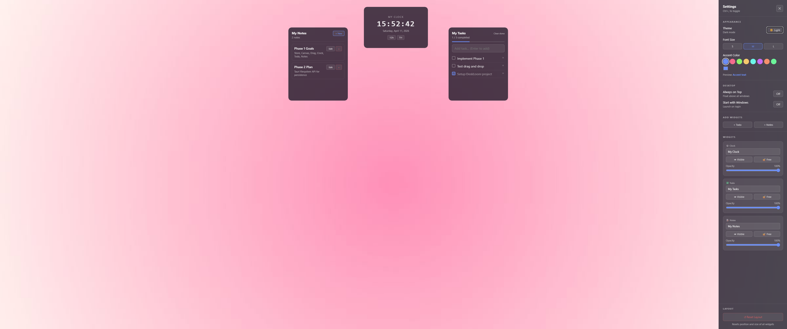
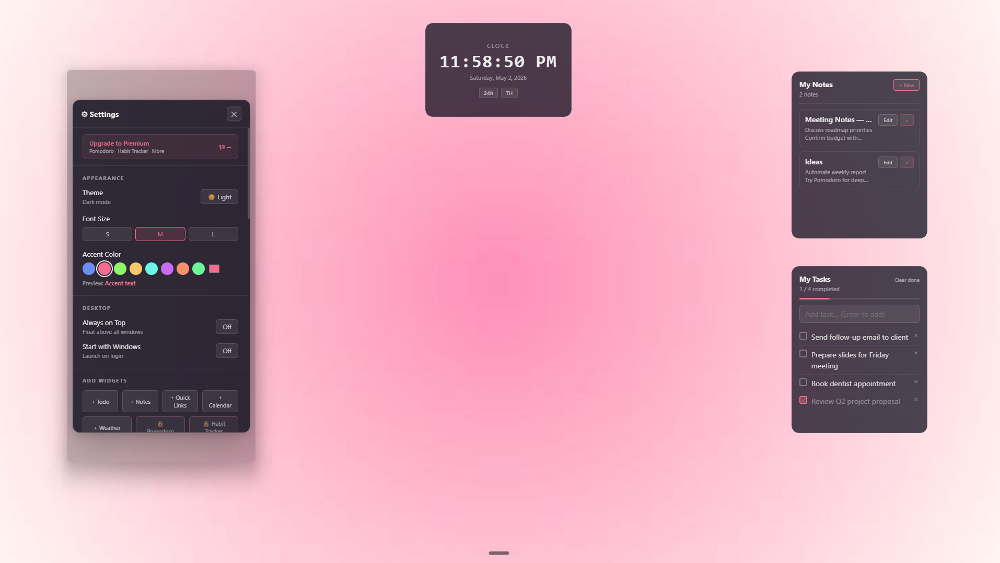
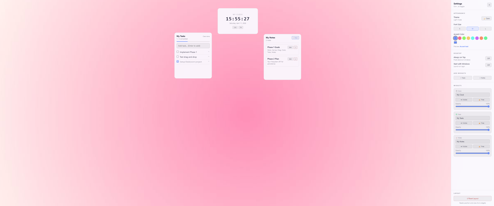

<div align="center">

# 🪟 DeskLoom

**A minimal desktop widget app for Windows**




</div>

---

## ✨ Features

| Feature | Description |
|---------|-------------|
| 🕐 **Clock widget** | 12h/24h toggle, Thai and English locale |
| ✅ **Todo widget** | Add, complete, delete tasks with progress bar |
| 📝 **Notes widget** | Create, edit, delete notes |
| 🖱️ **Drag & resize** | Move and resize all widgets freely |
| ➕ **Multiple instances** | Add extra Todo and Notes widgets |
| 🌙 **Dark / Light theme** | Smooth transition between modes |
| 🎨 **Accent color** | 8 presets + custom color picker |
| 🔠 **Font size** | Small / Medium / Large |
| 🔆 **Per-widget opacity** | 20%–100% |
| 📌 **Always on Top** | Float above all windows |
| 🚀 **Start with Windows** | Autostart on login |
| 🗂️ **System Tray** | Minimize to tray, click icon to toggle |

---

## 📸 Screenshots

| Widget Close-up | With Settings Panel |
|-----------|------------|
|  |  |

<div align="center">

**Full View**


</div>

---

## 💻 Requirements

- **Windows 11** (64-bit) — primary supported platform
- [Microsoft Edge WebView2 Runtime](https://developer.microsoft.com/en-us/microsoft-edge/webview2/) — pre-installed on most Windows 11 systems

---

## 🚀 Installation

### Option A — Download release *(recommended)*

1. Go to the [Releases](../../releases) page
2. Download `DeskLoom_0.1.0_x64-setup.exe`
3. Run the installer
4. DeskLoom launches automatically and appears in the system tray

### Option B — Build from source

**Prerequisites:**

- [Node.js](https://nodejs.org/) v18+
- [pnpm](https://pnpm.io/) v8+
- [Rust](https://rustup.rs/) stable toolchain
- Microsoft C++ Build Tools

```powershell
# Clone the repository
git clone https://github.com/suptaass/deskloom.git
cd deskloom

# Install dependencies
pnpm install

# Run in development mode
pnpm tauri dev

# Build installer
pnpm tauri build
```

Installer output: `src-tauri/target/release/bundle/nsis/`

---

## 📖 Usage

| Action | How |
|--------|-----|
| Move widget | Click header and drag |
| Resize widget | Drag any edge or corner |
| Open Settings | `Ctrl+,` |
| Lock widget position | Settings → Widget → 🔓 Free |
| Change theme | Settings → Appearance → Theme |
| Add Todo / Notes widget | Settings → Add Widgets |
| Hide to tray | Click ✕ on title bar |
| Show from tray | Click the tray icon |
| Quit | Right-click tray icon → Quit |

---

## 💾 Data Storage

DeskLoom saves all state to:

```
%APPDATA%\com.deskloom.app\state.json
```

- Written atomically (temp file → rename) to prevent data corruption
- Loads automatically on next launch
- Data is preserved after Quit from system tray

---

## ⚠️ Known Limitations

- **Windows 10** — not yet tested; Windows 11 is the primary supported platform
- **Many widgets** — adding more than ~10 widget instances will cause overlap; there is no auto-layout
- **Multi-monitor** — widget positions are not monitor-aware; may shift on secondary displays
- **No cloud sync** — data is stored locally only
- **Widget types** — currently Clock, Todo, and Notes only; more planned in future versions

---

## 🗺️ Roadmap

- **v0.2** — bug fixes from user feedback, hidden widget indicator
- **v0.3** — new widgets: Quick Links, Calendar, Weather, Pomodoro
- **v1.0** — per-widget OS window, click-through mode, snap to edge, multi-monitor support
- **v1.x** — widget marketplace, cloud sync, customization presets

---

## 🛠️ Tech Stack

| Layer | Technology |
|-------|------------|
| Desktop shell | Tauri v2 |
| UI framework | React 19 + TypeScript |
| State management | Zustand 5 |
| Persistence | Tauri Filesystem API |
| Build tool | Vite 6 |
| Package manager | pnpm |

---

## 📄 License

MIT © 2026 suptaass