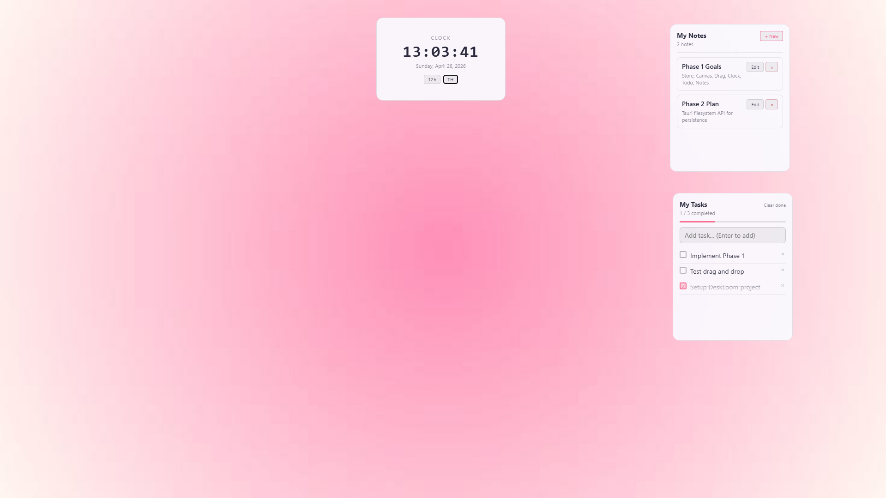
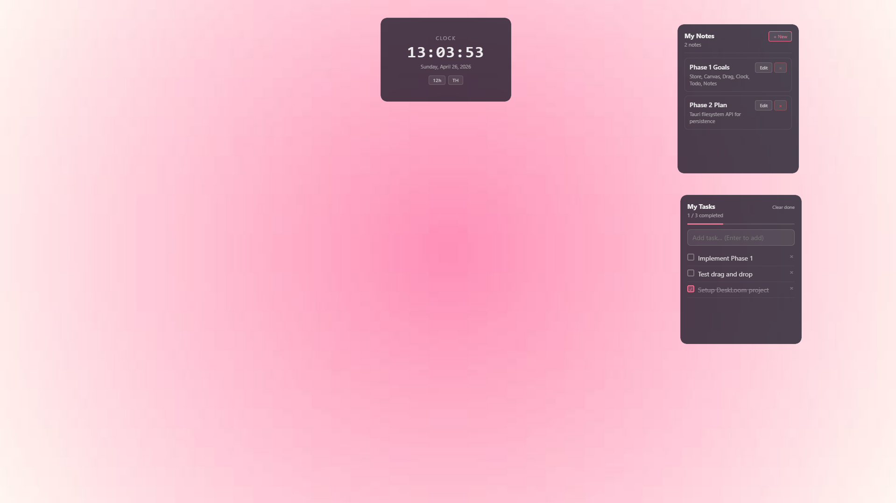
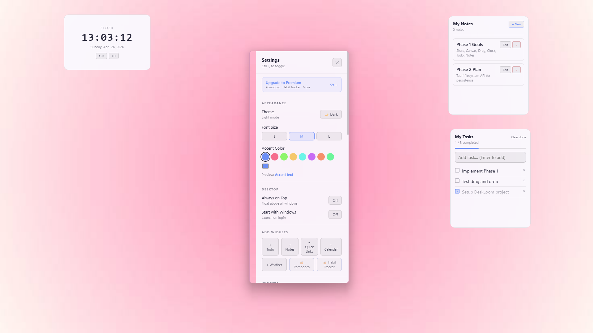
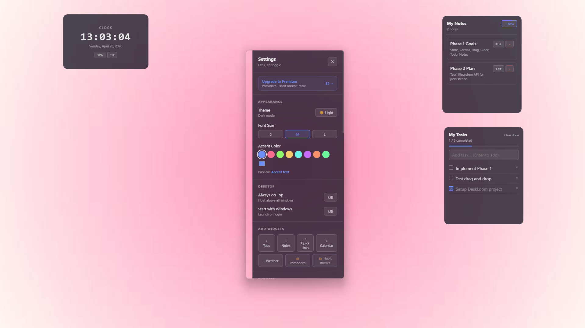
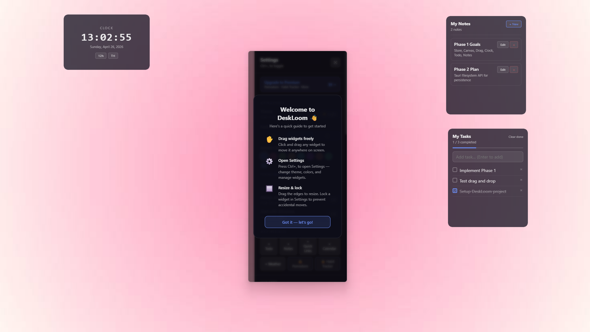

<div align="center">

# 🪟 DeskLoom

**A minimal desktop widget app for Windows**


[**⬇ Download v0.6.0**](https://github.com/suptaass/deskloom/releases/download/v0.6.0/DeskLoom_0.6.0_x64-setup.exe) · [Releases](../../releases) · [Report a bug](../../issues)

</div>

---

## ✨ Features

| Feature | Description |
|---------|-------------|
| 🕐 **Clock widget** | 12h/24h toggle, Thai and English locale |
| ✅ **Todo widget** | Add, complete, delete tasks with progress bar |
| 📝 **Notes widget** | Create, edit, delete notes |
| ⏱️ **Pomodoro** | Work/break timer — Premium |
| 📋 **Habit Tracker** | Daily habit streaks — Premium |
| 🔗 **Quick Links** | One-click URL launcher |
| 🌤️ **Weather** | Current weather via Open-Meteo (no API key needed) |
| 🖱️ **Drag & resize** | Move and resize all widgets freely |
| 🖥️ **Per-widget OS window** | Each widget is an independent system window |
| 🔢 **Multiple instances** | Add as many widget instances as you need |
| 🌙 **Dark / Light theme** | Smooth transition between modes |
| 🎨 **Accent color** | 8 presets + custom color picker |
| 🔆 **Per-widget opacity** | 20%–100% |
| 👆 **Click-through mode** | Mouse clicks pass through widget to desktop |
| 📌 **Always on Top** | Per-widget float above all windows |
| 🚀 **Start with Windows** | Autostart on login |
| 🗂️ **System Tray** | Lives in tray — click to open Settings |
| 🗃️ **Widget stacking** | Group widgets into tabbed stacks |
| 📅 **Schedule visibility** | Show/hide widgets by time and day |
| ⌨️ **Shortcut keys** | Custom hotkey per widget |
| 🖥️ **Multi-monitor** | Assign each widget to a specific monitor |
| 💾 **Export / Import layout** | Save and restore widget configurations |

---

## 📸 Screenshots

### Desktop

| Light theme | Dark theme |
|---|---|
|  |  |

### Settings & Customization

| Settings (Light) | Settings (Dark) | Accent Color |
|---|---|---|
|  |  |  |

### First-run Welcome



---

## 💻 Requirements

- **Windows 10 / 11** (64-bit)
- WebView2 Runtime — the installer handles this automatically

---

## 🚀 Installation

### Option A — Download installer *(recommended)*

1. Download [**DeskLoom_0.6.0_x64-setup.exe**](https://github.com/suptaass/deskloom/releases/download/v0.6.0/DeskLoom_0.6.0_x64-setup.exe)
2. Run the installer — if Windows shows a SmartScreen warning, click **More info → Run anyway**
3. DeskLoom starts automatically — look for the icon in the **system tray** (bottom-right corner)
4. Click the tray icon → open Settings

### Option B — Build from source

**Prerequisites:** Node.js v18+ · pnpm · Rust stable · Microsoft C++ Build Tools

```powershell
git clone https://github.com/suptaass/deskloom.git
cd deskloom
pnpm install
pnpm tauri dev       # development
pnpm tauri build     # build installer
```

---

## 📖 Usage

| Action | How |
|--------|-----|
| Open Settings | Click system tray icon |
| Move widget | Drag widget header |
| Resize widget | Drag any edge or corner |
| Lock position | Settings → Widget → Lock |
| Hide a widget | Settings → Widget → Hide |
| Add widget | Settings → Add Widgets |
| Quit | Right-click tray icon → Quit |

---

## 💾 Data Storage

All data is saved locally to:

```
%APPDATA%\com.deskloom.app\state.json
```

No account required. No internet connection needed (except Weather widget and license activation).

---

## 🔑 Premium

Premium unlocks: **Pomodoro · Habit Tracker**

<!-- Purchase link will be added when Gumroad product is live -->

---

## 🗺️ Roadmap

- **v0.6.x** — bug fixes and polish from user feedback
- **v0.7** — widget themes, snap-to-edge, new widget types
- **v1.0** — widget marketplace, cloud sync

---

## 🛠️ Tech Stack

| Layer | Technology |
|-------|------------|
| Desktop shell | Tauri v2 |
| UI framework | React 19 + TypeScript |
| State management | Zustand 5 |
| Persistence | Tauri Filesystem API |
| Build tool | Vite 7 |

---

## 📄 License

MIT © 2026 suptaass
